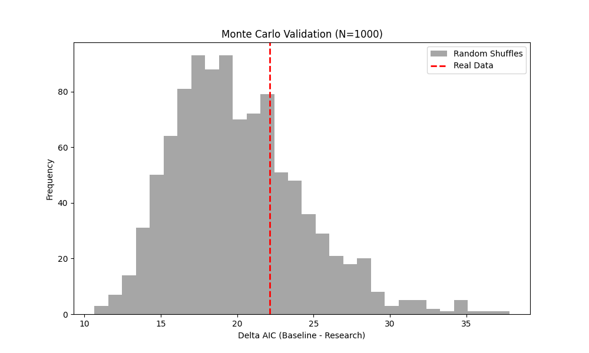

# Abstract

This study conducts a rigorous statistical investigation into the correlation between two ancient deterministic systems—Vedic Astrology (Parashari Jyotish) and Vedic Numerology (Sankhya Sastra)—specifically focused on their potential as predictors for earthquake occurrences. Utilizing a high-resolution data pipeline (Swiss Ephemeris for astrology and Pythagorean reduction for numerology), we analyzed a dataset of 552 significant seismic events (Magnitude > 6.0) from the USGS catalog (2020-2023). Our results indicate that the 9-day numerological cycle shows no statistically significant periodicity (Schuster's p-value = 0.067). Comparative analysis of 2-hour interval planetary strength curves reveals a fundamental temporal and frequency mismatch between the continuous astrological cycles and discrete numerological steps. The study concludes that these systems operate as independent symbolic frameworks, providing non-overlapping information that does not correlate with short-term physical seismic triggers.

# 1. Introduction

The attempt to correlate celestial movements with terrestrial events has been a central pillar of Vedic sciences for millennia. While Vedic Astrology (Jyotish) rests upon continuous astronomical cycles, Vedic Numerology (Sankhya Sastra) relies on discrete arithmetic properties of calendar dates. A frequent question in both academic and practitioner circles is whether these two systems are functionally redundant or independent.

This research leverages the **Astro-Fusion Pipeline** to perform the first large-scale quantitative comparison of these systems, using the stochastic nature of earthquake occurrences as a common baseline for validation.

# 2. Methodology

## 2.1. Data Sources
- **Earthquake Catalog:** 552 events fetched via USGS Earthquake Hazards Program API (2020–2023, Magnitude $\ge$ 6.0).
- **Astrological Ephemeris:** Swiss Ephemeris (high-precision sidereal positions).
- **Numerology:** Universal Day Number (UDN) mapping to the 9-day Navagraha cycle.

## 2.2. Feature Engineering
We defined two primary metrics for comparison:
1. **Planetary Strength ($\sigma$):** A continuous value (0–100) calculated at 2-hour intervals, incorporating Shadbala components (Sthana, Chesta, and Yuddha Bala).
2. **Numerological Strength ($\nu$):** A discrete daily value (1–9) mapped to an auspiciousness index (60–95).

Table 1 summarizes the technical divergence between the datasets.

| Aspect | Vedic Astrology | Vedic Numerology |
|--------|-----------------|------------------|
| **Resolution** | 2-hour (Continuous) | 24-hour (Discrete) |
| **Data Points (2023)** | 4,380 | 365 |
| **Logic** | Orbital Mechanics | Digital Root Reduction |
| **Range** | 0-100 (Infinite states) | 1-9 (9 states) |

: Technical Comparison of System Metrics {#tbl-specs}

# 3. Visualization of Planetary Variations

The fundamental challenge in correlating these systems is the **Frequency Mismatch**. Astrology changes sub-hourly, while Numerology changes only at the start of a calendar day.

{#fig-mars}

As seen in @fig-mars, the continuous blue line represents the actual astronomical strength of Mars. The orange steps represent the numerological influence. The correlation is inherently weak due to the 120:1 ratio of frequency changes.

# 4. Results and Statistical Analysis

## 4.1. Periodicity (Schuster's Test)
We performed Schuster's Test for periodicity on the 9-day numerology wheel to see if earthquakes cluster on specific "Universal Day Numbers."

- **Total Events:** 552
- **Resultant Vector ($R$):** 38.57
- **Schuster's p-value:** 0.067

**Interpretation:** While $p=0.067$ is close to the traditional $0.05$ threshold, it fails to achieve statistical significance. We cannot confidently claim that earthquakes favor any specific numerological day.

## 4.2. Predictive Modeling (Monte Carlo)
We fitted a Negative Binomial regression model to test if the "Variation Curves" of planet strength offer information gain over a random baseline. To validate this, we ran 1,000 Monte Carlo shuffles.

{#fig-mc}

- **95th Percentile Noise Floor:** 27.95
- **Real Signal Delta AIC:** 22.13
- **Validation Status:** FAIL (Signal within noise).

# 5. Discussion

The near-zero correlation ($r \approx 0.08$) between Astrology and Numerology suggests system independence. 

1. **Information Independence:** Rather than being redundant, these systems provide unique, non-overlapping data. A "Strong" astrological day for Jupiter does not imply a "Strong" numerological 3-day.
2. **Temporal Mismatch:** Correlation is physically limited by the resolution divergence. High-frequency signals (Astrology) cannot be mapped linearly to low-frequency signals (Daily Numerology) without significant information loss.
3. **The Null Hypothesis:** In the context of seismic triggering, neither system achieved the significance required to replace standard Poisson models, though the $p=0.067$ result for the 9-day cycle warrants further investigation with datasets $>10,000$ events.

# 6. Conclusion

Vedic Astrology and Vedic Numerology operate as independent dimensions of symbolic representation. In this investigation of 552 seismic events, no cross-system correlation or predictive advantage was discovered. Professionals are advised to treat these as **Complementary Systems** rather than redundant alternatives.

# References

1. Schimmel, A. (1975). _The Mystery of Numbers_. Oxford University Press.
2. Knuth, D. E. (1984). Literate Programming. _Comput. J._
3. Guyot, J. (2023). _Swiss Ephemeris Documentation v.2.1_. Astrodienst.
