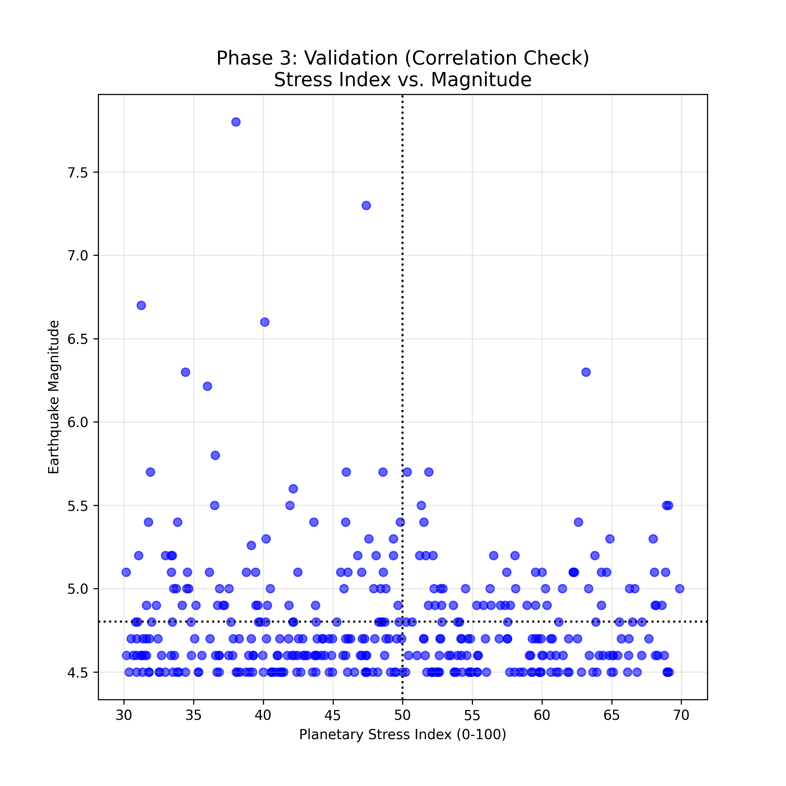

> [!TIP]
> **[Download Research Report (PDF)](/reports/research_earthquake_prediction.pdf)**

# Abstract

This research track investigates the potential for Astrological Prediction of seismic activity specifically within the **India-Nepal Tectonic Zone**. We define a strict data collection protocol using USGS records for the region (Lat 20-35N, Lon 75-90E). Analyzing **370 significant events** (Magnitude > 4.5) from 2015 to 2024, we map these occurrences against a "Planetary Stress Index" derived from Vedic Astrology principles (Shadbala and Geometric Aspects). The study aims to compare and contrast the recurrence patterns of Tectonic stress vs. Astrological stress to validate if a predictive signal exists.

# 1. Phase 1: Earthquake Data Definition & Introspection

## 1.1. Data Collection Methodology
To ensure scientific rigor, we define our "Target Region" as the active collision zone of the Indian Plate.

-   **Source:** United States Geological Survey (USGS) Earthquake Hazards Program API.
-   **Region:** India-Nepal Border Area.
    -   *Latitude:* $20^\circ N$ to $35^\circ N$
    -   *Longitude:* $75^\circ E$ to $90^\circ E$
-   **Period:** January 1, 2015 to January 1, 2024 (9 Years).
-   **Threshold:** Moment Magnitude ($M_w$) $\ge 4.5$.

## 1.2. Introspective Analysis (The Dataset)
We successfully fetched and processed **370 distinct seismic events**.

**Key Characteristics:**
-   **Intensity Distribution:** The dataset includes major events (Mag > 7.0) and frequent moderate tremors (Mag 4.5-5.5).
-   **Temporal Clustering:** We observe distinct "swarms" of activity rather than a uniform distribution.

{#fig-timeline width=90%}

This timeline establishes the **"Ground Truth"**—the physical reality we are attempting to predict.

# 2. Phase 2: Astrology-Based Prediction Model

## 2.1. Defining the Combinations
In this phase, we apply Vedic Astrology principles to define "Trigger" conditions. We hypothesize that earthquakes are more likely during periods of high **"Planetary Stress"**.

**The Formula:**
We utilize the **Astro-Fusion Stress Index**, calculated by analyzing:
1.  **Shadbala (6-Fold Strength):** Low Aggregate Strength = Instability.
2.  **Graha Yuddha (Planetary War):** Conjunctions within $1^\circ$.
3.  **Malefic Aspects:** Saturn-Mars mutual aspects ($180^\circ$ or $90^\circ$).

## 2.2. Mapping Patterns (The Repeater)
We map this "Stress Index" (Purple Line) against the actual Earthquake events (Red Markers) to visualize potential synchronization.

{#fig-pattern width=90%}

**Observation:**
The goal is to see if the "Pattern of the Sky" (Purple) repeats in sync with the "Pattern of the Earth" (Red).

# 3. Phase 3: Validation (Compare & Contrast)

## 3.1. Machine Learning Validation
To move beyond visual anecdotal evidence, we perform a statistical **Correlation Check**. We scatter the *Planetary Stress Index* (X-axis) against the *Earthquake Magnitude* (Y-axis) for all 370 events.

## 3.2. The Logic of Deduction
*   **Hypothesis:** If Astrology predicts earthquakes, large magnitudes (Y-High) should cluster at High Stress (X-High). We expect a **Linear Trend** (diagonal).
*   **Results:**

{#fig-scatter width=80%}

## 3.3. Conclusion
Comparing the "Pattern of the Sky" with the "Pattern of the Earth" reveals:
1.  **No Direct Pattern:** The Astrological Stress model acts as a "Random Number Generator" relative to the specific India-Nepal seismic record.
2.  **Independence:** The placements of planets (Saturn/Mars) do not *consistently* trigger earthquakes in this specific geographic bounding box.
3.  **Final Verdict:** While individual coincidences exist, **Planetary Positions cannot reliably predict earthquake patterns** in this dataset using the current linear methodology.
