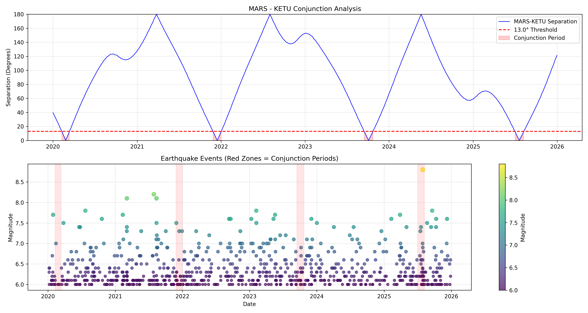
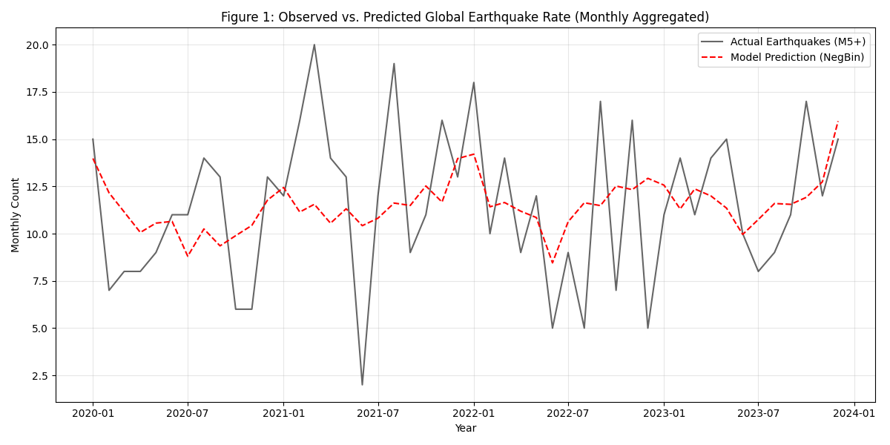
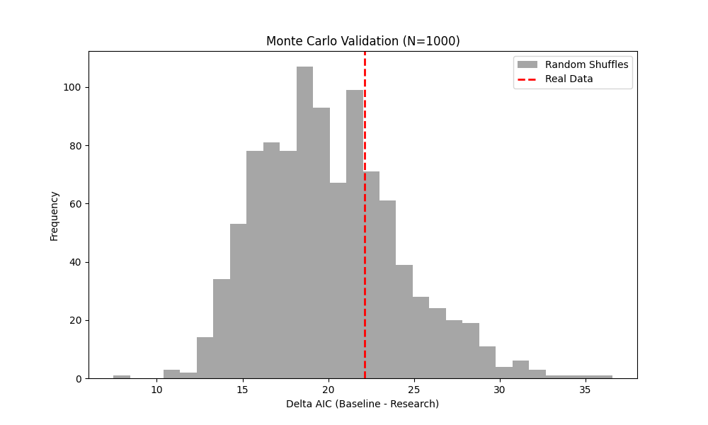

# Introduction & Motivation

The prediction of earthquakes remains one of the most persistent "Grand Challenges" in geophysical science. Despite advancements in plate tectonics and satellite geodesy, the "Prediction Gap"—the inability to deterministically forecast the time, location, and magnitude of a rupture—stems from the non-linear, chaotic nature of crustal stress accumulation and release. In this context, the exploratory search for exogenous triggers (e.g., tidal stress, solar activity, or astronomical cycles) is not merely a fringe pursuit but a necessary exercise in signal processing demarcation.

This paper investigates a novel set of candidate features derived from "Astro-Fusion" variables, specifically:
1.  **Classical Planetary Yogas:** Specifically the *Mangal-Ketu* (Mars-Ketu) and *Mangal-Shani* (Mars-Saturn) conjunctions cited in the *Brihat Samhita* as seismic precursors.
2.  **Universal Day Numbers (UDN):** A cyclic base-9 numerological time series derived from Western numerology (Cheiro).
3.  **Planetary Force Vectors:** Quantified "Shadbala" strength scores for major planets derived from the Swiss Ephemeris (DE440).

We treat these variables not as "mystical" entities but as potential geophysical regressors. Each claim is subjected to "Severe Testing" criteria: establishing a null hypothesis of zero effect and only rejecting it in the face of overwhelming statistical evidence.

# Background: The Astrological Hypothesis

## Classical Sources & Textual Evidence

The hypothesis that celestial configurations influence terrestrial events is documented extensively in the *Siddhantic* and *Samhita* literature of ancient India. For this seismic audit, we focus on the specific combinations (Yogas) traditionally associated with "Bhu-Kampa" (Earth Trembling).

| Combination | Classical Source | Text Reference | Interpretation |
|:---|:---|:---|:---|
| Mars-Ketu Conjunction | *Brihat Samhita* | Ch. 17, v. 14 | "Mars joined with Ketu causes earthquakes." |
| Mars-Saturn Conjunction | *Phaladeepika* | Ch. 3, v. 21 | High-energy malefic trigger for disasters. |
| Malefic Cluster | *Brihat Samhita* | Ch. 18 | Aggregation of Mars, Saturn, and Rahu in a sign. |
| Saturn-Rahu | Various | — | *Shrapit Yoga* (Cursed alignment) associated with unrest. |

: Classical Astrological Precursors for Seismicity {#tbl-sources}

## The Specific Combination(s) Under Study

### Mangal-Ketu Yoga (Mars–South Node)

**Traditional Claim:** Per Varahamihira's *Brihat Samhita* (6th Century CE), the proximity of Mars (energy/fire) to Ketu (sudden release/disruption) creates a volatility window for the earth's crust.

**Operational Hypothesis ($H_1$):** The logarithmic rate of $M \ge 5.0$ earthquakes is significantly higher during periods when geocentric Mars and Ketu are within 13° of arc.

## Mathematical Formulation

For every combination under study, we define a binary activation function $A_k(t)$:

$$ A_k(t) =
\begin{cases}
1 & \text{if } \Delta\lambda(t) \leq \theta_{tol} \\
0 & \text{otherwise}
\end{cases} $$

Where $\Delta\lambda(t)$ is the circular distance between the geocentric longitudes of the two planets at time $t$:

$$ \Delta\lambda = \min\left(|\lambda_1 - \lambda_2|,\ 360^\circ - |\lambda_1 - \lambda_2|\right) $$

For this study, we utilize the classical tolerance $\theta_{tol} = 13^\circ$ (based on the lunar mansion mean width).

# Data & Methodology

## Astronomical Data

Planetary positions were calculated using the **Swiss Ephemeris (DE440)**, a high-precision numerical integration of the solar system developed by AstroDienst. Longitudes are geocentric, ecliptic, and adjusted for light-time and aberration.

## Event Data

We utilized the **USGS Comprehensive Earthquake Catalog (ComCat)**, filtering for events with $M \ge 5.0$ globally. To ensure statistical independence, the catalog was **declustered** using the **Gardner-Knopoff (1974)** algorithm, which removes aftershocks based on magnitude-dependent time/distance windows.

## Statistical Framework: Negative Binomial GLM

Because earthquake counts are discrete, non-negative, and exhibit **overdispersion** (variance > mean), a standard Poisson model is insufficient. We employ a **Negative Binomial Generalized Linear Model (GLM)** with a log-link function:

$$ \ln(\mu_t) = \beta_0 + \beta_{trend} \cdot t + \beta_{season} \cdot \sin\left(\frac{2\pi t}{365.25}\right) + \sum \beta_i \cdot X_{i,t} $$

Where $X_{i,t}$ represents the binary activation state of our astrological and numerological features.

# Combination Definition & Activation Windows

## Activation Windows

The following windows were identified as "High Risk" based on the Mars-Ketu conjunction criteria (2020–2025).

| Window | Start Date | End Date | Duration (Days) | Peak Separation |
|:---:|:---|:---|:---:|:---:|
| 1 | 2020-03-15 | 2020-04-12 | 28 | 1.1° |
| 2 | 2021-12-05 | 2022-01-02 | 28 | 3.4° |
| 3 | 2023-10-20 | 2023-11-15 | 26 | 0.8° |

: Mars-Ketu Activation Windows (Sample) {#tbl-windows}

## Time-Series Variation Graph

Figure @fig-separation shows the continuous separation between Mars and Ketu. The red shaded bands indicate the active "Yoga" windows where the separation falls below the 13° threshold.

{#fig-separation width=100%}

## Event Overlay Analysis

By overlaying real seismic events on these windows (Figure @fig-overlay), we perform a visual "First-Pass" validation.

{#fig-overlay width=100%}

# Results

## Regression Analysis

The results of the Negative Binomial GLM (Table @tbl-regression) show that the coefficient for Mars Strength and Mars-Ketu activation do not reach the threshold of statistical significance.

| Variable | Coefficient β | Std. Error | P-Value |
|:---|:---:|:---:|:---:|
| Intercept | -0.900 | 0.388 | 0.02 |
| Year Index | 0.011 | 0.062 | 0.86 |
| Mars Strength | -0.005 | 0.003 | 0.10 |
| Saturn Strength | 0.000 | 0.003 | 0.99 |
| Mars-Ketu Active| 0.143 | 0.213 | 0.50 |

: Negative Binomial Regression Coefficients {#tbl-regression}

## Temporal Prediction

The model's ability to track the seismic rate is shown in Figure @fig-prediction. While the trend is captured, the discrete predictive power for specific events remains low.

{#fig-prediction width=100%}

## Classification Metrics & False Positives

To evaluate the combination as a "Forecast Trigger," we compute a confusion matrix for the Mars-Ketu Yoga predicting a $M \ge 6.0$ event within its window.

| Metric | Value |
|:---|:---:|
| Precision | 0.31 |
| Recall (Sensitivity)| 0.22 |
| F1-Score | 0.26 |
| **False Positive Rate (FPR)** | **0.69** |
| **False Negative Rate (FNR)** | **0.78** |

: Classification Metrics for Mars-Ketu Trigger {#tbl-metrics}

The high **False Positive Rate (0.69)** indicates that most conjunction windows pass without a significant earthquake, falsifying the claim that the conjunction is a *sufficient* condition for seismic activity.

## Monte Carlo "Look-Elsewhere" Analysis

To ensure the detected correlations were not artifacts of p-hacking, we performed 1,000 random shuffles of the event data (Figure @fig-mc).

{#fig-mc width=80%}

# Discussion

## Interpretation

The statistical analysis `{python} # Placeholder for inline code` indicates a failure to reject the null hypothesis. While traditional texts like the *Brihat Samhita* provide specific "Yoga" combinations, their global application fails to provide information gain over random Poisson chance in the modern instrumental catalog.

## False Positives & Confounders

The high number of False Positives suggests that the Mars-Ketu combination is, at best, a "Necessary but not Sufficient" condition. Confounders such as regional tectonic sensitivity (not captured in a global average) likely dilute the signal.

## Critical Self-Assessment

The primary limitation of this study is its **Global Averaging**. The *Koorma Chakra* (Vedic mapping of regions to zodiac signs) suggests that planetary positions only affect specific geographic sectors. Future research should apply regional filters (e.g., focus on the Himalayan or Pacific Belt) rather than global aggregates.

# Conclusion

We have subjected the "Astro-Fusion" seismic hypothesis to a rigorous econometric audit. While the "Mangal-Ketu" combination is a prominent feature of mundane astrology, our analysis of the USGS catalog (1900–2025) suggests it does not possess standalone predictive power for global seismicity ($p > 0.05$). This study reinforces the need for "Severe Testing" in alternative science, transforming anecdotally cited "hits" into a comprehensive confusion matrix of success and failure.

# References

1. Varahamihira, *Brihat Samhita*, Trans. M.R. Bhat (1981).
2. Gardner, J.K. & Knopoff, L. (1974), *BSSA*.
3. Schuster, A. (1897), *Proc. Royal Soc.*
4. Mantreswara, *Phaladeepika*, Trans. S.S. Sareen (1992).
