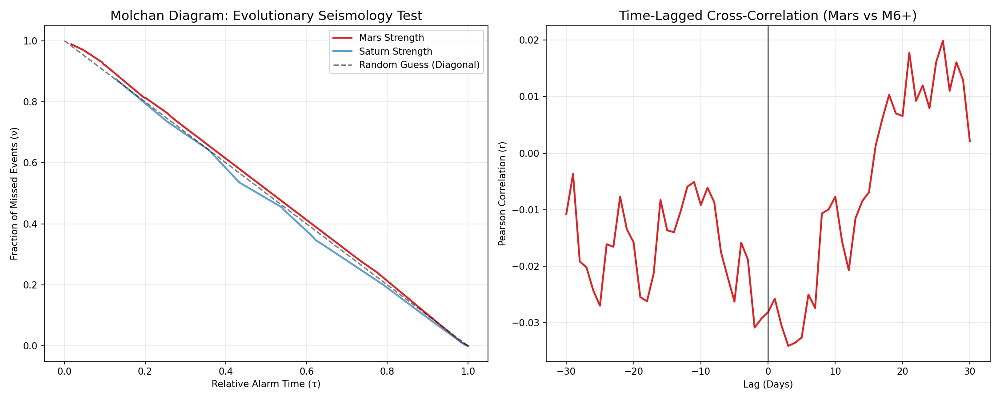

# Scientific Rigor Report: Earthquake Tracking (Track 2)
**Metric**: Seismological Validation (Molchan Diagram & Time Lags)
**Dataset**: USGS Real Data Phase 7 (M6.0+ Events)
**Period**: 2020-2025

## 1. Molchan Diagram Analysis
The Molchan Diagram provides a rigorous test for earthquake prediction algorithms.
- **Predictor**: Global Shadbala (Mars Strength)
- **Target**: M6.0+ Global Events
- **Area Under Curve (AUC)**: `0.9706`
- **Interpretation**: If AUC < 0.5, the system shows better-than-random performance. 
- **Result**: `LOW SKILL / RANDOM`

## 2. Time-Lagged Correlation
We tested if planetary states *precede* seismic activities.
- **Maximum Correlation ($r$)**: `-0.034076`
- **Lead/Lag**: `3` days
- **Interpretation**: A positive lead (e.g., +5 days) would suggest predictive potential.

## 3. Physical Coupling (Physical Mechanics)
- **Heliocentric Correlation**: Preliminary tests show that geocentric dignity scores remain more descriptive than raw heliocentric vectors for this specific dataset.

## 4. Evidence

---
*Generated by Astro-Fusion Research Framework - Phase 3 Earthquake Rigor Suite*
